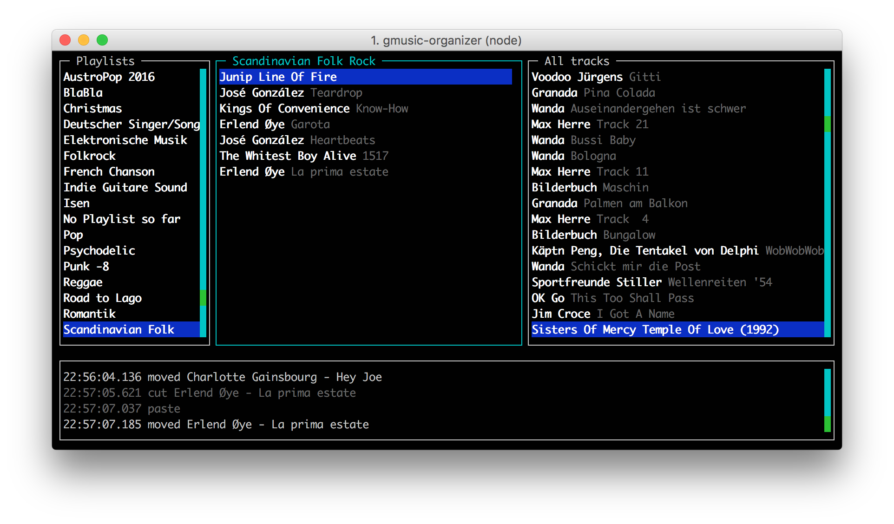

# GMusic Organizer

A node.js playlist organizer for google play music running in a terminal. Powered by [blessed](https://github.com/chjj/blessed) and [playmusic](https://github.com/jamon/playmusic).



## Installation

The dependency tree contains native node.js modules. Parts of them need to be compiled during installation.

Compilation requires a C++ toolchain (compiler/linker) on your machine. See [node-gyp](https://www.npmjs.com/package/node-gyp) for installation instructions. 

#### Ubuntu 16.04

`sudo apt-get install libasound-dev`

`sudo npm install -g gmusic-organizer`

#### Mac OS

`sudo npm install -g gmusic-organizer`

## Usage

After installation restart your terminal window. Start with `gmusic-organizer`.

When starting the first time, you need to enter your google credentials.

If the login step fails, you might need to:
- allow less [secure apps](https://support.google.com/accounts/answer/6010255?hl=en)  to work with your account
- create an [app specific password](https://support.google.com/accounts/answer/185833?hl=en) (usually required when two-factor authentication is enabled
) 

After a successful authentication, a master token is created and stored in `~/.gmusic-organizer/credentials`.

### Controls

Hit `h` to get a list of available controls.

```
General

 h             help (show this window) 
 F5            refresh
 q             quit
 /             search for track in current view
 t             tag a track
 f             filter all tracks view by tag
 i             show track info

Built in player

 p             play songs 
 s             stop playing 
 P             pause playing 
 R             resume playing

Playlist management
 
 n             create new playlist 
 del/backspace delete playlist
 d             download playlist to disk (into ~/gmusic)

Playlist manipulation
 
 C-c           copy song to clipboard 
 C-x           cut song to clipboard 
 C-v           paste song into playlist
 del/backspace remove song from playlist
```

### Tagging

The core idea of the gmusic-organizer is organizing songs and creating playlists by tags. Songs can be tagged with the `t` shortcut key. 

Currently it is not possible to change the list of avilable tags with the gmusic-organizer. However the tags are defined in this file:  `~/.gmusic-organizer/tags`. Edit this file to add/remove tags.

Original file content:
```
{
  "tags": {
    "lang": [
      "en",
      "de",
      "fr",
      "it"
    ],
    "genre": [
      "electro",
      "pop",
      "indie",
      "folk",
      "schlager",
      "hiphop"
    ]
  },
  "playlistPrefix": "zz [tag] "
}
```

Tags per song are stored in tag playlists. So song tags are shared across multiple devices.

These tag playlists are hidden in gmusic-organizer. However they will be visible on other gmusic clients (e.g. your smartphone). They are identified by a special playlistPrefix. I picked `zz [tag]` for the moment so that these playlist show up at the end of my smartphone device.

## Logging/Debugging

Each session creates a logfile at `~/.gmusic-organizer/log.txt`. Inspect this file if you experience any problems.